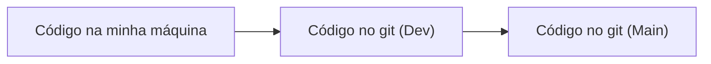
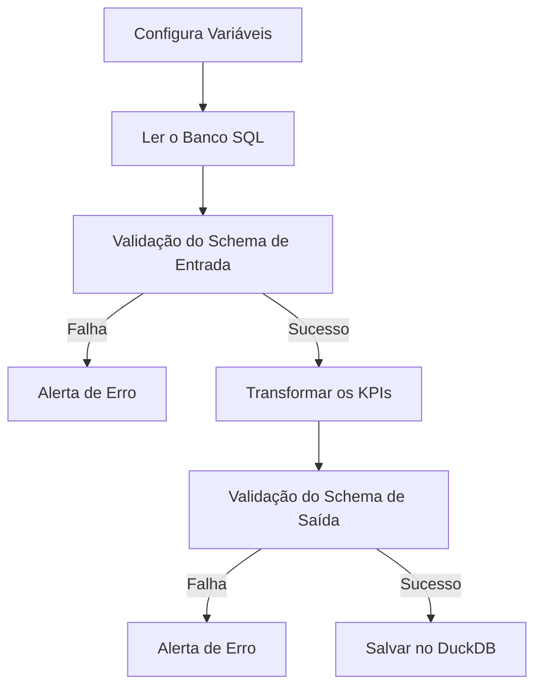

# Patient ratings identifying best drugs

## Objetivo

### Teste unitário
Permite testar o código na sua máquina antes de subir para um repositório GIT

```mermaid
graph LR
    A["Código na minha máquina"]
    B["Código no git (Dev)"]
    C["Código no git (Main)"]
    A --> B
    B --> C
```

```mermaid
graph TD;
    A[Configura Variáveis] --> B[Ler o Banco SQL];
    B --> V[Validação do Schema de Entrada];
    V -->|Falha| X[Alerta de Erro];
    V -->|Sucesso| C[Transformar os KPIs];
    C --> Y[Validação do Schema de Saída];
    Y -->|Falha| Z[Alerta de Erro];
    Y -->|Sucesso| D[Salvar no DuckDB];
```